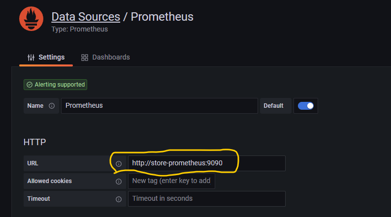
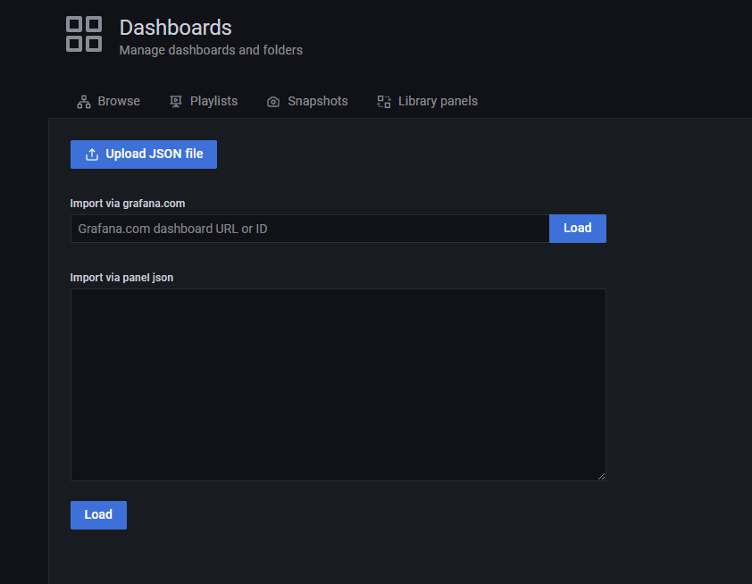
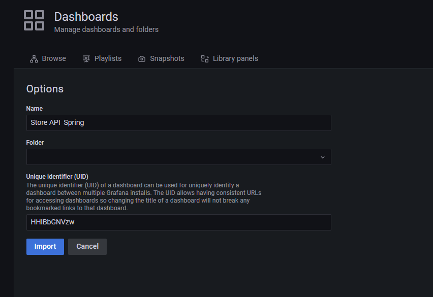
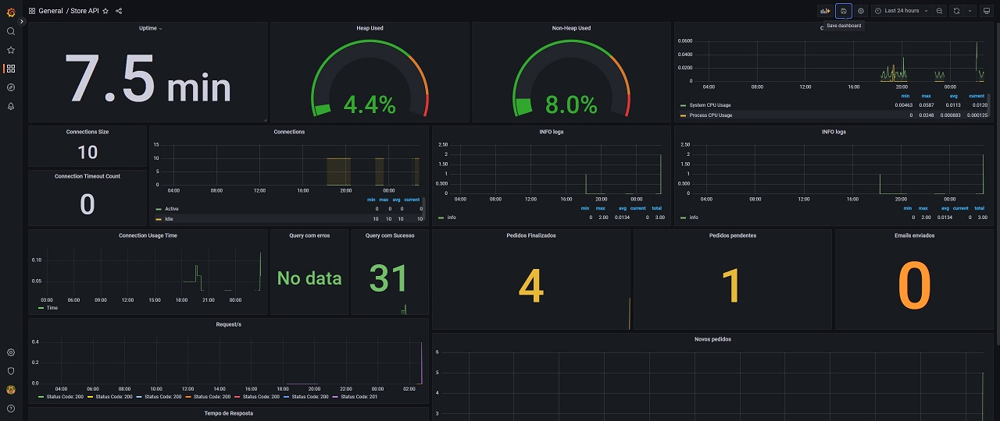

# Exemplo de Aplicação com Spring Boot

Este é um exercício simples, um gerenciador de pedidos simples. Onde foi desenvolvido uma API onde os usuários podem criar e gerenciar pedidos. Os itens podem ser encomendados e os pedidos são atendidos automaticamente assim que o estoque do item permitir.

### Executar a Aplicação

*Requisito:* Necessário docker e docker-compose instalado.

#### 1 - Baixar o respositorio
  * Caso deseja testar o envio do email configurar os parametros no arquivo:
   `src/main/resources/application.properties` as seguintes informações:

    <pre>
    spring.mail.host=smtp host
    spring.mail.port=port of smtp server
    spring.mail.username=login user to smtp server
    spring.mail.password=login password to smtp server
    spring.mail.properties.mail.smtp.auth=true or false
    spring.mail.properties.mail.smtp.starttls.enable=true or false
    </pre>

#### 2 - Criar a imagem da api:
  - Pelo terminal acessar a pasta do projeto e executar o comando:
  
   `docker build -t store-api --progress=plain .`

  - Se tudo correr bem vamos subir os containers para executar aplicação completa:

    `docker-compose up -d`

### 3 - Aplicação
#### Swagger da API:
* Basta acessar o endereço http://localhost:8000/swagger-ui/index.html

#### PgAdmin
* Endereço: http://localhost:16543/
* Usuário: `admin@admin.com.br`
* Senha: `Postgres2022!`

#### Grafana
* Endereço: http://localhost:3000/
* Usuario: `admin`
* Senha: `admin`

* #### Configurado o datasource
  * 1 - Clique em `Configuration` -> `Datasources` -> `Add Datasources`
  * 2 - Clique em Clique em `Prometheus`
  * 3 - Preencha os dados conforme imagem abaixo:

    

  * 4 - Clique em `Dashboards` -> `Import`
    
    Clique no botão `Upload Json File` e selecione o arquivo `store-infra\dashboard-grafana.json`
  
    
    
    Na segunda tela clique em `Import`
  
    

    Se tudo tiver corrido bem será apresentado o dashbord conforme abaixo:
    
    